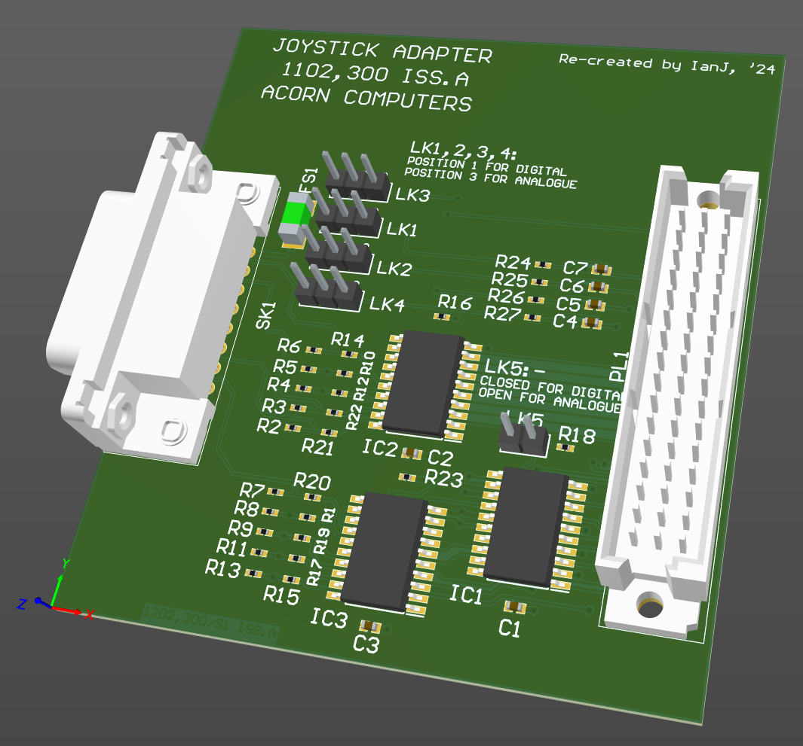

# Acorn A7000 / RiscPC Joystick 'NIC'

April 2025

A re-creation of the official (but not commercially released?) Acorn "1102,300" Joystick Adapter, for Acorn A7000 and RiscPC machines NIC slot.

On A7000 (only), this can support analog joysticks, as the ARM7500 SoC includes appropriate analog to digital converters, not found in the RiscPC.

This has been built and tested and appears to work as expected for digital inputs, however one half of each analog axis appears inverted - this may be a software issue, however has yet to be fully investigated.

[PDF schematic](Generated/A7000RiscPC_Joystick.pdf)

## Licence

No warranty is provided, and this work is used at your own risk.  

Licenced as CC BY-SA 4.0

Copyright 2025 Ian Jeffray

